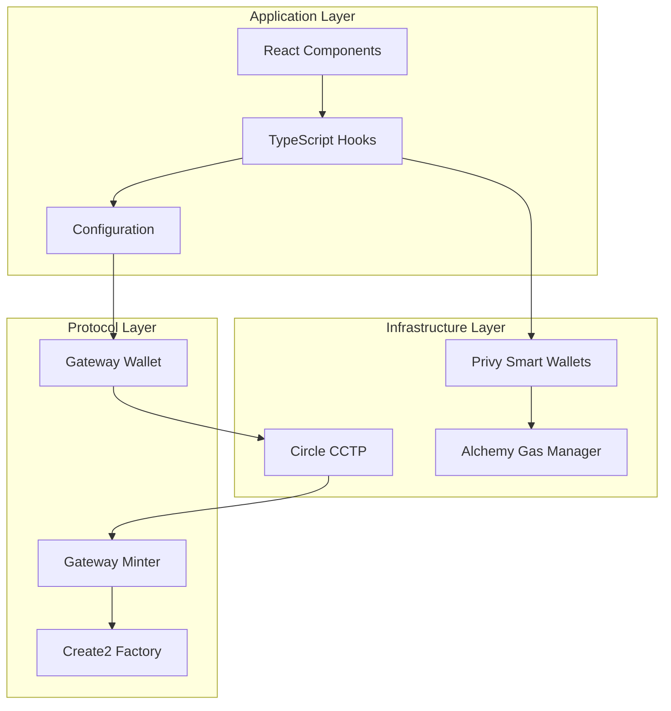
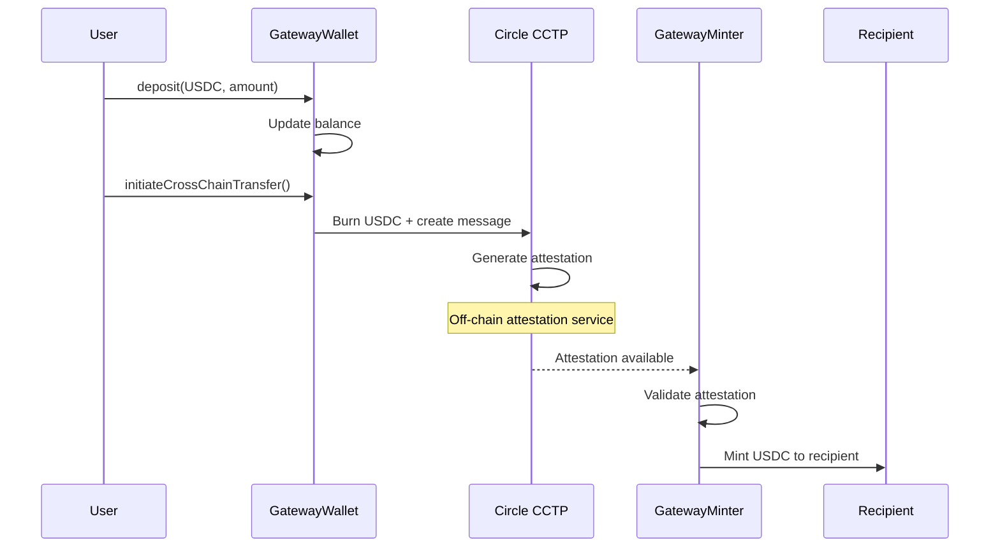
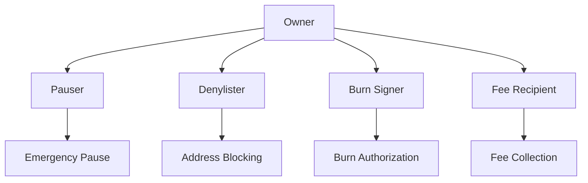

# System Architecture

> **Enterprise-grade architecture for cross-chain USDC transfers**

## 🏗️ High-Level Overview

The CCTP Gateway Protocol consists of three main layers:

1. **Application Layer** - React components and hooks for user interaction
2. **Protocol Layer** - Smart contracts managing cross-chain transfers  
3. **Infrastructure Layer** - Circle CCTP, Privy wallets, and Alchemy gas sponsorship



## 🔄 Cross-Chain Transfer Flow

### Phase 1: Source Chain Operations

1. **User Authentication**
   - User connects via Privy (social login, email, SMS)
   - Smart wallet created/accessed automatically
   - Multi-chain support enabled

2. **USDC Approval** (Gasless)
   - User approves USDC spending for GatewayWallet
   - Transaction sponsored by Alchemy Gas Manager
   - No gas fees for end user

3. **Deposit to Gateway**
   - USDC transferred from user to GatewayWallet
   - Balance tracked in contract storage
   - Deposit event emitted for monitoring

4. **Cross-Chain Message Creation**
   - GatewayWallet creates burn intent
   - Message includes destination chain, recipient, amount
   - Burn message sent to Circle CCTP

### Phase 2: Circle Attestation

5. **Circle Processing**
   - Circle's attestation service validates burn
   - Cryptographic proof generated
   - Attestation made available via API

6. **Attestation Retrieval**
   - Frontend polls Circle's API for attestation
   - Retry logic handles temporary failures
   - Attestation cached for reliability

### Phase 3: Destination Chain Operations

7. **Mint Authorization**
   - GatewayMinter receives attestation
   - Validates cryptographic proof
   - Authorizes USDC mint on destination chain

8. **USDC Minting** (Gasless)
   - Native USDC minted to recipient address
   - Transaction sponsored by Alchemy
   - Mint event emitted for confirmation

9. **Transfer Completion**
   - Cross-chain transfer marked as complete
   - User notified via UI
   - Analytics and monitoring updated

## 🏛️ Smart Contract Architecture

### Core Contracts

#### GatewayWallet
**Purpose**: Manages USDC deposits and cross-chain message initiation

```solidity
contract GatewayWallet {
    // Core Functions
    function deposit(address token, uint256 amount) external;
    function initiateCrossChainTransfer(...) external returns (bytes32);
    function withdraw(address token) external;
    
    // Admin Functions
    function pause() external onlyPauser;
    function addSupportedToken(address token) external onlyOwner;
}
```

**Key Features**:
- Multi-token support (USDC primary)
- Pausable for emergency stops
- Role-based access control
- Withdrawal delay for security

#### GatewayMinter
**Purpose**: Handles USDC minting on destination chains

```solidity
contract GatewayMinter {
    // Core Functions
    function gatewayMint(bytes attestation, bytes signature) external;
    function completeCrossChainTransfer(...) external;
    
    // Admin Functions
    function setAttestationSigner(address signer) external onlyOwner;
    function addMintAuthority(address token, address authority) external;
}
```

**Key Features**:
- Attestation validation
- Signature verification
- Mint authority management
- Replay attack prevention

#### Create2Factory
**Purpose**: Deterministic contract deployment across chains

```solidity
contract Create2Factory {
    function deploy(bytes32 salt, bytes bytecode) external returns (address);
    function computeAddress(bytes32 salt, bytes32 bytecodeHash) external view returns (address);
}
```

**Key Features**:
- Deterministic addresses
- Cross-chain consistency
- Deployment cost optimization

### Contract Interactions



## 🔧 Frontend Architecture

### Component Hierarchy

```
CrossChainPayment (Main Component)
├── ChainSelector
├── AmountInput
├── RecipientInput
├── StatusDisplay
└── TransactionHistory
```

### Hook Architecture

#### useCrossChainPayment
**Primary hook for cross-chain operations**

```typescript
interface CrossChainPaymentHook {
  // State
  paymentStatus: PaymentStatus;
  
  // Actions
  initiatePayment: (params: PaymentParams) => Promise<void>;
  checkUSDCBalance: (chainId: number, address: string) => Promise<string>;
  resetPaymentStatus: () => void;
  
  // Utilities
  approveUSDC: (chainId: number, spender: string, amount: string) => Promise<string>;
  depositToGateway: (chainId: number, amount: string) => Promise<string>;
}
```

### State Management

```typescript
interface PaymentStatus {
  status: 'idle' | 'approving' | 'depositing' | 'waiting_attestation' | 'minting' | 'completed' | 'error';
  txHash?: string;
  error?: string;
  attestation?: string;
  progress?: number;
}
```

## 🌐 Multi-Chain Configuration

### Chain Registry

```typescript
interface ChainConfig {
  id: number;
  name: string;
  rpcUrl: string;
  blockExplorer: string;
  usdc: string;
  domain: number;
  gatewayWallet?: string;
  gatewayMinter?: string;
}

const SUPPORTED_CHAINS: ChainConfig[] = [
  {
    id: 11155111,
    name: 'Ethereum Sepolia',
    rpcUrl: 'https://eth-sepolia.g.alchemy.com/v2/{API_KEY}',
    blockExplorer: 'https://sepolia.etherscan.io',
    usdc: '0x1c7D4B196Cb0C7B01d743Fbc6116a902379C7238',
    domain: 0
  },
  // ... other chains
];
```

### Deployment Strategy

1. **Deterministic Addresses**: Using Create2 for consistent addresses across chains
2. **Proxy Pattern**: Upgradeable contracts for future improvements
3. **Role Management**: Multi-signature wallets for admin functions
4. **Monitoring**: Event-based monitoring across all chains

## 🔒 Security Architecture

### Access Control



### Security Layers

1. **Smart Contract Security**
   - OpenZeppelin standards
   - Reentrancy protection
   - Overflow/underflow protection
   - Access control modifiers

2. **Operational Security**
   - Multi-signature governance
   - Time-locked upgrades
   - Emergency pause mechanism
   - Role separation

3. **Infrastructure Security**
   - Encrypted RPC endpoints
   - Secure key management
   - Rate limiting
   - DDoS protection

## 📊 Monitoring & Analytics

### Event Tracking

```solidity
// Key events for monitoring
event Deposited(address indexed token, address indexed user, uint256 amount);
event CrossChainTransferInitiated(bytes32 indexed transferId, uint32 destinationDomain);
event CrossChainTransferCompleted(bytes32 indexed transferId, address recipient);
event EmergencyPause(address indexed pauser, uint256 timestamp);
```

### Metrics Dashboard

- **Volume Metrics**: Daily/monthly transfer volumes
- **Performance Metrics**: Average transfer times, success rates
- **Security Metrics**: Failed transactions, pause events
- **User Metrics**: Active users, retention rates

## 🚀 Scalability Considerations

### Current Limitations

- **Circle CCTP Dependency**: Reliant on Circle's attestation service
- **Gas Costs**: Deployment costs scale with number of chains
- **Attestation Delays**: 12-20 minute attestation times

### Future Optimizations

- **Batch Processing**: Multiple transfers in single transaction
- **State Channels**: Instant transfers for frequent users  
- **Layer 2 Integration**: Polygon, Arbitrum support
- **Mobile SDK**: React Native components

## 🔮 Future Architecture

### Planned Enhancements

1. **Advanced Features**
   - Scheduled transfers
   - Recurring payments
   - Multi-token support
   - Liquidity pools

2. **Infrastructure Improvements**
   - Decentralized attestation
   - Cross-chain governance
   - Advanced monitoring
   - Mobile applications

3. **Enterprise Features**
   - Whitelabel solutions
   - API access
   - Bulk operations
   - Compliance tools

---

This architecture provides a solid foundation for enterprise-grade cross-chain USDC transfers while maintaining flexibility for future enhancements.
