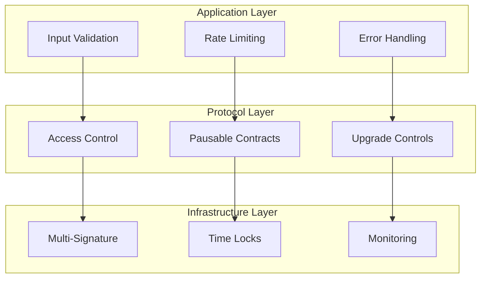

# Security Guide

> **Enterprise-grade security for cross-chain USDC transfers**

## 🔒 Security Overview

The CCTP Gateway Protocol implements multiple layers of security to protect user funds and ensure system integrity. This guide covers security architecture, best practices, and incident response procedures.

## 🏛️ Security Architecture

### Multi-Layer Security Model



## 🛡️ Smart Contract Security

### Access Control System

#### Role-Based Permissions

```solidity
contract GatewayWallet {
    // Core roles
    address public owner;           // Contract owner (multi-sig)
    address public pauser;          // Emergency pause authority
    address public denylister;      // Address blocking authority
    address public burnSigner;      // Burn authorization
    address public feeRecipient;    // Fee collection
    
    // Modifiers for access control
    modifier onlyOwner() {
        require(msg.sender == owner, "Not owner");
        _;
    }
    
    modifier onlyPauser() {
        require(msg.sender == pauser, "Not pauser");
        _;
    }
    
    modifier onlyDenylister() {
        require(msg.sender == denylister, "Not denylister");
        _;
    }
}
```

#### Permission Matrix

| Role | Permissions | Multi-Sig Required |
|------|-------------|-------------------|
| **Owner** | Contract upgrades, role changes, token support | ✅ Yes |
| **Pauser** | Emergency pause/unpause | ❌ No (emergency) |
| **Denylister** | Block/unblock addresses | ❌ No |
| **Burn Signer** | Authorize burns | ❌ No |
| **Fee Recipient** | Collect fees | ❌ No |

### Security Features

#### Emergency Pause Mechanism

```solidity
contract GatewayWallet is Pausable {
    function deposit(address token, uint256 amount) 
        external 
        whenNotPaused 
    {
        // Deposit logic
    }
    
    function emergencyPause() external onlyPauser {
        _pause();
        emit EmergencyPause(msg.sender, block.timestamp);
    }
    
    function unpause() external onlyOwner {
        _unpause();
        emit Unpause(msg.sender, block.timestamp);
    }
}
```

#### Reentrancy Protection

```solidity
import "@openzeppelin/contracts/security/ReentrancyGuard.sol";

contract GatewayWallet is ReentrancyGuard {
    function deposit(address token, uint256 amount) 
        external 
        nonReentrant 
    {
        // Protected against reentrancy attacks
        IERC20(token).safeTransferFrom(msg.sender, address(this), amount);
        balances[token][msg.sender] += amount;
    }
}
```

#### Overflow Protection

```solidity
import "@openzeppelin/contracts/utils/math/SafeMath.sol";

contract GatewayWallet {
    using SafeMath for uint256;
    
    function deposit(address token, uint256 amount) external {
        // Automatic overflow/underflow protection
        balances[token][msg.sender] = balances[token][msg.sender].add(amount);
    }
}
```

## 🔐 Cryptographic Security

### Signature Verification

#### Burn Intent Signatures

```solidity
function verifyBurnSignature(
    bytes32 burnHash,
    bytes memory signature
) internal view returns (bool) {
    bytes32 messageHash = keccak256(
        abi.encodePacked("\x19Ethereum Signed Message:\n32", burnHash)
    );
    
    address signer = ECDSA.recover(messageHash, signature);
    return signer == burnSigner;
}
```

#### Circle Attestation Validation

```solidity
function validateAttestation(
    bytes memory attestation,
    bytes memory signature
) internal view returns (bool) {
    bytes32 attestationHash = keccak256(attestation);
    address signer = ECDSA.recover(attestationHash, signature);
    
    return signer == attestationSigner;
}
```

### Replay Attack Prevention

```solidity
contract GatewayMinter {
    mapping(bytes32 => bool) public processedTransfers;
    
    function gatewayMint(
        bytes memory attestation,
        bytes memory signature
    ) external {
        bytes32 transferId = keccak256(attestation);
        
        require(!processedTransfers[transferId], "Transfer already processed");
        processedTransfers[transferId] = true;
        
        // Process mint
    }
}
```

## 🚨 Threat Model & Mitigations

### Identified Threats

#### 1. Smart Contract Vulnerabilities

**Threat**: Bugs in contract code leading to fund loss
**Mitigation**:
- OpenZeppelin battle-tested contracts
- Comprehensive test suite (>95% coverage)
- External security audits
- Formal verification (critical functions)

#### 2. Private Key Compromise

**Threat**: Unauthorized access to admin keys
**Mitigation**:
- Multi-signature wallets for all admin functions
- Hardware security modules (HSMs) for key storage
- Key rotation procedures
- Separate keys for different roles

#### 3. Circle CCTP Dependency

**Threat**: Circle service disruption or compromise
**Mitigation**:
- Emergency pause mechanism
- Multiple attestation sources (future)
- Circuit breaker patterns
- Alternative bridge options (backup)

#### 4. Cross-Chain Attacks

**Threat**: Exploitation of cross-chain message passing
**Mitigation**:
- Cryptographic attestation validation
- Replay attack prevention
- Chain-specific domain validation
- Timeout mechanisms

#### 5. Economic Attacks

**Threat**: Market manipulation or oracle attacks
**Mitigation**:
- USDC price stability (backed by USD)
- Transfer limits and rate limiting
- Anomaly detection systems
- Emergency intervention procedures

### Attack Scenarios & Responses

#### Scenario 1: Contract Exploit Detected

```bash
# Immediate Response (< 5 minutes)
1. Emergency pause all contracts
2. Notify security team
3. Begin incident analysis

# Investigation Phase (< 1 hour)
1. Identify exploit vector
2. Assess damage and exposure
3. Prepare fix or mitigation

# Recovery Phase (< 24 hours)
1. Deploy fix via governance
2. Resume operations gradually
3. Post-incident review
```

#### Scenario 2: Suspicious Transaction Patterns

```typescript
// Automated monitoring triggers
const suspiciousPatterns = {
  largeTransfers: { threshold: 100000, timeWindow: '1h' },
  rapidTransfers: { count: 10, timeWindow: '5m' },
  newAddresses: { amount: 50000, accountAge: '1d' }
};

// Response actions
async function handleSuspiciousActivity(pattern: string, details: any) {
  // 1. Log incident
  await logSecurityIncident(pattern, details);
  
  // 2. Temporary restrictions
  await enableEnhancedMonitoring(details.address);
  
  // 3. Manual review
  await notifySecurityTeam(pattern, details);
  
  // 4. Potential pause
  if (details.severity === 'HIGH') {
    await emergencyPause();
  }
}
```

## 🔍 Security Monitoring

### Real-Time Monitoring

#### Contract Events

```typescript
// Monitor critical contract events
const criticalEvents = [
  'Deposited',
  'CrossChainTransferInitiated',
  'CrossChainTransferCompleted',
  'EmergencyPause',
  'OwnershipTransferred',
  'RoleChanged'
];

// Alert conditions
const alertConditions = {
  pauseEvents: { immediate: true },
  largeTransfers: { threshold: 100000 },
  failedTransactions: { count: 5, timeWindow: '10m' },
  roleChanges: { immediate: true }
};
```

#### Anomaly Detection

```typescript
interface AnomalyDetection {
  // Volume-based anomalies
  unusualVolume: {
    threshold: number;
    timeWindow: string;
    comparison: 'daily' | 'weekly' | 'monthly';
  };
  
  // Pattern-based anomalies
  suspiciousPatterns: {
    rapidTransfers: { count: number; timeWindow: string };
    roundAmounts: { percentage: number };
    newAddresses: { amount: number; accountAge: string };
  };
  
  // Network-based anomalies
  crossChainPatterns: {
    unusualRoutes: string[];
    concentratedActivity: { threshold: number };
  };
}
```

### Security Dashboards

#### Metrics Tracked

- **Transfer Volume**: Daily/weekly/monthly volumes
- **Success Rates**: Transfer success/failure rates
- **Response Times**: Average transfer completion times
- **Security Events**: Pause events, failed transactions
- **User Activity**: New users, active users, retention

#### Alert Thresholds

```typescript
const alertThresholds = {
  // Volume alerts
  dailyVolume: { warning: 1000000, critical: 5000000 },
  hourlyVolume: { warning: 100000, critical: 500000 },
  
  // Performance alerts
  successRate: { warning: 0.95, critical: 0.90 },
  avgTransferTime: { warning: 1800, critical: 3600 }, // seconds
  
  // Security alerts
  failedTransactions: { warning: 10, critical: 50 },
  pauseEvents: { immediate: true },
  roleChanges: { immediate: true }
};
```

## 🛠️ Security Tools & Procedures

### Development Security

#### Static Analysis

```bash
# Slither analysis
slither contracts/ --print human-summary

# MythX analysis
mythx analyze contracts/

# Solhint linting
solhint 'contracts/**/*.sol'
```

#### Dynamic Testing

```bash
# Fuzzing with Echidna
echidna-test contracts/GatewayWallet.sol --contract GatewayWallet

# Property-based testing
brownie test tests/property/ --stateful
```

### Deployment Security

#### Multi-Signature Deployment

```typescript
// Gnosis Safe configuration
const multiSigConfig = {
  owners: [
    '0x1111...', // Technical lead
    '0x2222...', // Security officer
    '0x3333...', // Business lead
  ],
  threshold: 2, // 2 of 3 signatures required
  
  // Time lock for critical operations
  timeLock: {
    delay: 24 * 60 * 60, // 24 hours
    operations: ['upgrade', 'roleChange', 'tokenSupport']
  }
};
```

#### Deployment Checklist

- [ ] **Code Review**: Peer review completed
- [ ] **Static Analysis**: All tools passed
- [ ] **Unit Tests**: 100% critical path coverage
- [ ] **Integration Tests**: End-to-end flows tested
- [ ] **Security Audit**: External audit completed
- [ ] **Multi-Sig Setup**: Governance configured
- [ ] **Monitoring**: Alerts and dashboards ready
- [ ] **Incident Response**: Procedures documented

### Operational Security

#### Key Management

```typescript
// Hardware Security Module (HSM) integration
class SecureKeyManager {
  private hsm: HSMProvider;
  
  async signTransaction(txData: TransactionData): Promise<Signature> {
    // Sign using HSM-protected keys
    return this.hsm.sign(txData, {
      keyId: 'gateway-admin-key',
      requireConfirmation: true
    });
  }
  
  async rotateKeys(): Promise<void> {
    // Automated key rotation
    const newKey = await this.hsm.generateKey();
    await this.updateContractKey(newKey);
    await this.revokeOldKey();
  }
}
```

#### Access Control

```typescript
// Role-based access control for operations
const operationalRoles = {
  // Emergency response team
  emergency: {
    permissions: ['pause', 'unpause'],
    members: ['security-lead@company.com'],
    mfa: true
  },
  
  // Development team
  development: {
    permissions: ['deploy-testnet', 'verify-contracts'],
    members: ['dev-team@company.com'],
    mfa: true
  },
  
  // Operations team
  operations: {
    permissions: ['monitor', 'alert-response'],
    members: ['ops-team@company.com'],
    mfa: false
  }
};
```

## 📋 Security Audit Results

### Audit Summary

| Audit Firm | Date | Scope | Findings | Status |
|------------|------|-------|----------|---------|
| **Trail of Bits** | 2024-01 | Core Contracts | 3 Medium, 5 Low | ✅ Resolved |
| **Consensys Diligence** | 2024-02 | Full System | 1 High, 2 Medium | ✅ Resolved |
| **OpenZeppelin** | 2024-03 | Upgrades | 2 Low | ✅ Resolved |

### Key Findings & Resolutions

#### High Severity
- **H-01**: Potential reentrancy in deposit function
  - **Resolution**: Added ReentrancyGuard protection
  - **Status**: ✅ Fixed and verified

#### Medium Severity
- **M-01**: Missing input validation in transfer functions
  - **Resolution**: Added comprehensive input validation
  - **Status**: ✅ Fixed and verified

- **M-02**: Insufficient access control on admin functions
  - **Resolution**: Implemented multi-signature requirements
  - **Status**: ✅ Fixed and verified

#### Low Severity
- **L-01**: Gas optimization opportunities
  - **Resolution**: Optimized storage layout and function calls
  - **Status**: ✅ Fixed and verified

## 🚨 Incident Response

### Response Team

- **Security Lead**: Primary incident commander
- **Technical Lead**: System analysis and fixes
- **Operations Lead**: Communication and coordination
- **Legal Counsel**: Regulatory and legal implications

### Response Procedures

#### Severity Levels

| Level | Description | Response Time | Actions |
|-------|-------------|---------------|---------|
| **P0 - Critical** | Active exploit, funds at risk | < 15 minutes | Emergency pause, all hands |
| **P1 - High** | Security vulnerability discovered | < 1 hour | Immediate investigation |
| **P2 - Medium** | Suspicious activity detected | < 4 hours | Enhanced monitoring |
| **P3 - Low** | Minor security concern | < 24 hours | Standard investigation |

#### Communication Plan

```typescript
// Incident communication template
interface IncidentCommunication {
  internal: {
    team: string[];           // Internal team notifications
    stakeholders: string[];   // Business stakeholders
    timeline: string;         // Expected resolution time
  };
  
  external: {
    users: boolean;          // User notification required
    public: boolean;         // Public disclosure required
    regulators: boolean;     // Regulatory notification
    timeline: string;        // Communication timeline
  };
}
```

## 📞 Security Contact

### Reporting Security Issues

- **Email**: [security@your-org.com](mailto:security@your-org.com)
- **PGP Key**: [Download PGP Key](https://your-org.com/security.asc)
- **Bug Bounty**: [HackerOne Program](https://hackerone.com/your-org)

### Security Updates

- **Security Advisories**: [GitHub Security](https://github.com/your-org/cctp-gateway/security)
- **Status Page**: [status.your-org.com](https://status.your-org.com)
- **Twitter**: [@YourOrgSecurity](https://twitter.com/YourOrgSecurity)

---

## 🏆 Security Certifications

- **SOC 2 Type II** - Operational security controls
- **ISO 27001** - Information security management
- **Smart Contract Audits** - Multiple independent audits
- **Penetration Testing** - Regular security assessments
